# Change Data Capture Pipeline - Project Flowchart

## High-Level Architecture Overview

```mermaid
flowchart TB
    subgraph External["External Systems"]
        KAFKA["☁️ Apache Kafka<br/>entity-change-events"]
        MINIO["💾 MinIO (S3)<br/>Object Storage"]
    end

    subgraph FlinkApp["Apache Flink Application"]
        MAIN["Main.java<br/>Entry Point"]
        
        subgraph Config["Configuration Layer"]
            CONFIG_LOADER["ConfigLoader"]
            APP_CONFIG["AppConfig"]
            KAFKA_CONFIG["KafkaConfig"]
            S3_CONFIG["S3Config"]
            ICEBERG_CONFIG["IcebergConfig"]
        end
        
        subgraph Sources["Source Layer"]
            KAFKA_BUILDER["KafkaSourceBuilder"]
            KAFKA_SOURCE["KafkaSource<ObjectNode>"]
        end
        
        subgraph Transform["Transformation Layer"]
            HEADER_TRANS["OrderHeaderTransformer"]
            DETAILS_TRANS["OrderDetailsTransformer"]
        end
        
        subgraph Sink["Sink Layer"]
            ICEBERG_UTIL["IcebergUtil"]
            SINK_BUILDER["IcebergSinkBuilder"]
            HEADER_MAPPER["OrderHeaderMapper"]
            DETAILS_MAPPER["OrderDetailsMapper"]
        end
    end

    subgraph Storage["Iceberg Tables"]
        ORDERS_TABLE["📊 db.orders<br/>Order Headers"]
        DETAILS_TABLE["📊 db.order_details<br/>Order Line Items"]
    end

    KAFKA --> KAFKA_SOURCE
    KAFKA_SOURCE --> HEADER_TRANS
    KAFKA_SOURCE --> DETAILS_TRANS
    HEADER_TRANS --> HEADER_MAPPER
    DETAILS_TRANS --> DETAILS_MAPPER
    HEADER_MAPPER --> ORDERS_TABLE
    DETAILS_MAPPER --> DETAILS_TABLE
    ORDERS_TABLE --> MINIO
    DETAILS_TABLE --> MINIO
```

---

## Detailed Data Flow

```mermaid
flowchart LR
    subgraph Input["1️⃣ Input"]
        KT["Kafka Topic<br/>entity-change-events"]
    end
    
    subgraph Ingest["2️⃣ Ingestion"]
        KS["KafkaSource<br/>JSON Deserialization"]
        WM["Watermark Strategy<br/>(No Watermarks)"]
    end
    
    subgraph Parse["3️⃣ Parsing"]
        OBJ["ObjectNode<br/>Raw JSON Events"]
        FEA["features[]<br/>Array of Orders"]
    end
    
    subgraph Transform["4️⃣ Transformation"]
        direction TB
        OH["Order Header<br/>Transformer"]
        OD["Order Details<br/>Transformer"]
    end
    
    subgraph Convert["5️⃣ Row Conversion"]
        HM["Header Mapper<br/>ObjectNode → RowData"]
        DM["Details Mapper<br/>ObjectNode → RowData"]
    end
    
    subgraph Output["6️⃣ Output"]
        IT1["Iceberg Table<br/>db.orders"]
        IT2["Iceberg Table<br/>db.order_details"]
    end
    
    subgraph Store["7️⃣ Storage"]
        S3["MinIO S3<br/>s3a://warehouse/db/"]
    end

    KT --> KS --> WM --> OBJ --> FEA
    FEA --> OH --> HM --> IT1 --> S3
    FEA --> OD --> DM --> IT2 --> S3
```

---

## Component Interaction Diagram

---

## Package Structure

```mermaid
flowchart TB
    subgraph root["com.salescode"]
        MAIN["Main.java<br/>🚀 Entry Point"]
        
        subgraph config["config/"]
            AC["AppConfig.java"]
            CL["ConfigLoader.java"]
            KC["KafkaConfig.java"]
            IC["IcebergConfig.java"]
            SC["S3Config.java"]
        end
        
        subgraph kafka["kafka/"]
            KSB["KafkaSourceBuilder.java"]
        end
        
        subgraph transformer["transformer/"]
            OHT["OrderHeaderTransformer.java"]
            ODT["OrderDetailsTransformer.java"]
        end
        
        subgraph sink["sink/"]
            ISB["IcebergSinkBuilder.java"]
        end
        
        subgraph iceberg["iceberg/"]
            IU["IcebergUtil.java"]
            CIT["CreateIcebergTables.java"]
        end
    end

    MAIN --> config
    MAIN --> kafka
    MAIN --> transformer
    MAIN --> sink
    sink --> iceberg
```

---

## Data Transformation Flow

---

## Technology Stack

| Layer | Technology | Purpose |
|-------|------------|---------|
| **Streaming** | Apache Flink | Real-time stream processing |
| **Source** | Apache Kafka | Message broker / event streaming |
| **Format** | JSON | Data serialization format |
| **Table Format** | Apache Iceberg | ACID-compliant table format |
| **Storage** | MinIO (S3-compatible) | Object storage backend |
| **File Format** | Parquet | Columnar storage format |
| **Config** | YAML | Application configuration |
| **Build** | Maven | Dependency management |

---

## Key Features

- ✅ **Real-time CDC Processing** - Continuous streaming from Kafka
- ✅ **Dual Output Streams** - Separate Order Headers and Order Details tables
- ✅ **Checkpointing** - 10-second intervals for fault tolerance
- ✅ **Iceberg Integration** - ACID transactions and time-travel queries
- ✅ **S3-Compatible Storage** - MinIO for local development
- ✅ **Schema Transformation** - JSON to structured RowData conversion
